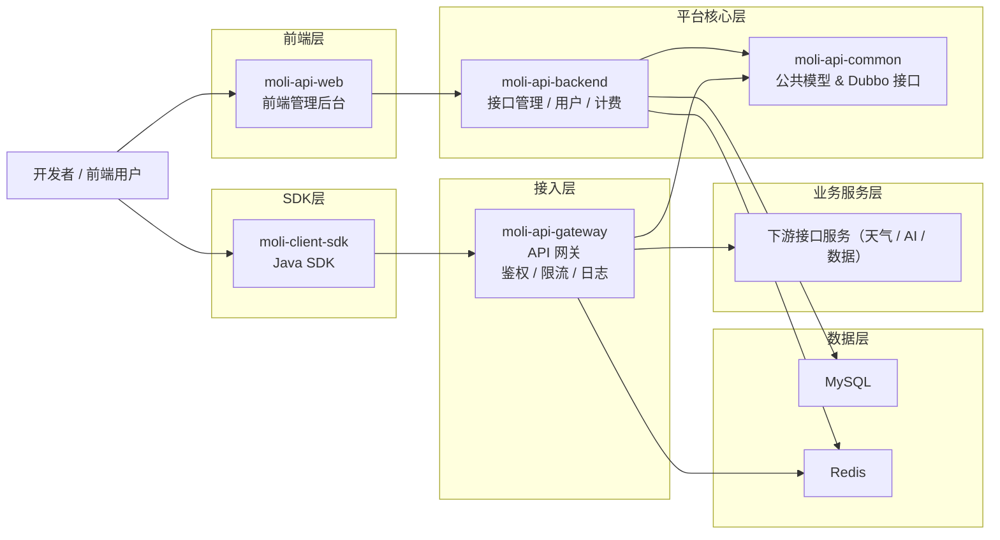
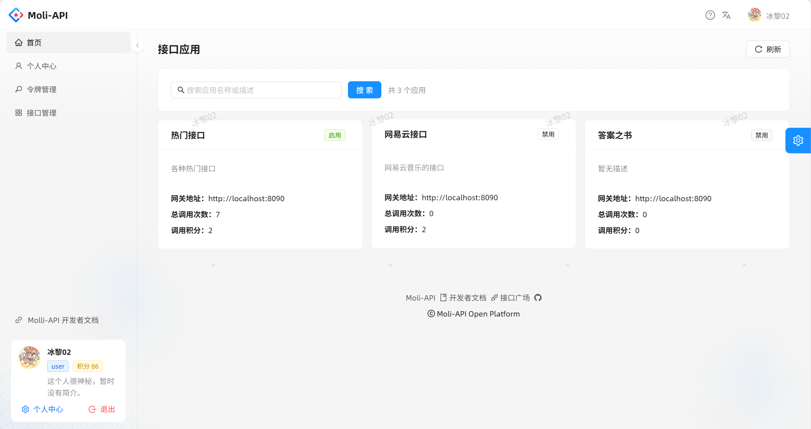
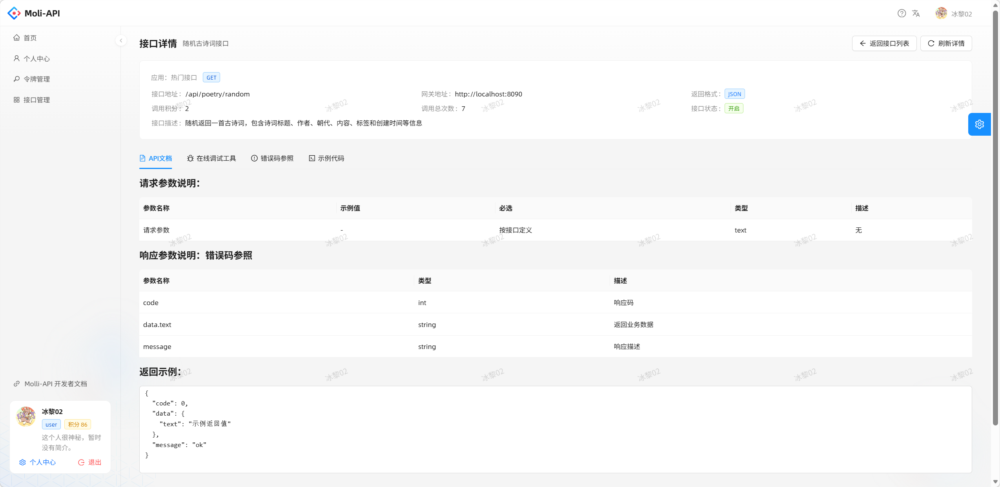
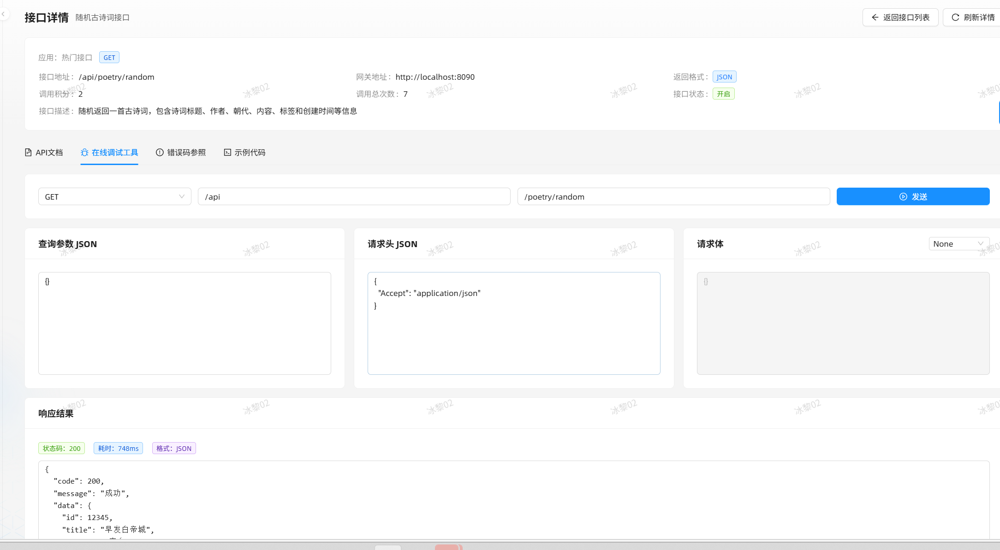

# Molli-API


Molli-API 是一个面向开发者的 **API 开放平台**，提供从 **接口发布、网关鉴权、在线调试、调用统计、积分计费，到 SDK 接入** 的完整能力。

## 功能特性

- 接口管理：统一维护接口路径、请求方式、参数说明与接口状态
- 应用管理：按应用维度配置下游服务地址、调用积分与统计信息
- 网关鉴权：基于 `AccessKey / SecretKey` 的签名认证机制
- 在线调试：支持前端直接调试接口并查看返回结果
- 调用统计：自动统计接口与应用调用次数
- 积分计费：按应用配置扣减用户积分
- Java SDK：提供 `moli-client-sdk` 快速接入平台接口
- 开发者文档：前端内置开发者文档与调用说明

## 项目架构



## 项目结构

- `MoLiAPI/moli-api-backend`：开放平台核心后端
- `MoLiAPI/moli-api-gateway`：API 网关
- `MoLiAPI/moli-api-common`：公共模块
- `moli-api-web/api-web`：前端开发者平台
- `moli-client-sdk`：Java SDK
- `moli-client-demo`：SDK 示例项目




   

## 快速启动

### 1. 启动基础环境

- 准备 MySQL
- 准备 Redis
- 导入项目 SQL 初始化脚本

### 2. 启动后端与网关

```bash
cd MoLiAPI
mvn clean install
```

分别启动：

- `moli-api-backend`
- `moli-api-gateway`

### 3. 启动前端

```bash
cd moli-api-web/api-web
npm install
npm run dev
```

### 4. 启动 SDK 示例项目

```bash
cd moli-client-demo
mvn spring-boot:run
```

## 技术栈

### 后端

- Java 17
- Spring Boot
- Spring Cloud Gateway
- MyBatis-Plus
- Dubbo
- MySQL
- Redis

### 前端

- React
- Umi Max
- TypeScript
- Ant Design
- Ant Design Pro Components


## License

This project is for learning and secondary development.
